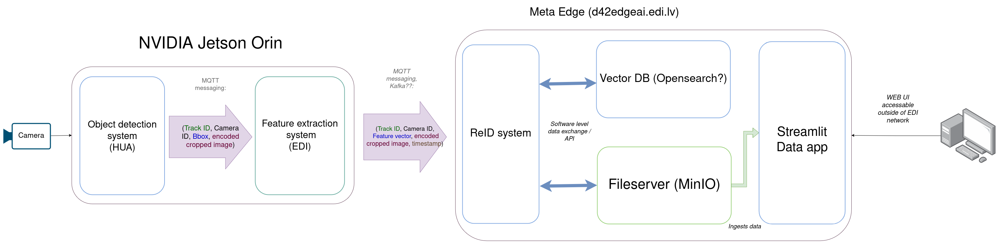

# ReID Service (Meta Edge Server)



This service runs on the **meta edge server (not Jetson)** and is responsible for:

* Receiving extracted vehicle embeddings (from FE container on the Jetson)
* one message -> a "sighting" (saved in MinIO datalake)
* Aggregating single-track sightings into "vehicle events"
* Each vehicle event gets a feature vector centroid
* Storing and querying feature vector centroids (OpenSearch k-NN)
* ReIdentified vehicle events get placed under stame vehicle ID
* Long term storage of data in MinIO Data lake

---

# Input / Output Overview

## Input (Sighting Stream)

The service consumes a stream of **sightings**


## MQTT Input Format

When using `INPUT_MODE=mqtt`, the service expects messages in this format:

```json id="mqtt_in_1"
{
    "cam_id": "cam_1",
    "track_id": 42,
    "timestamp_ns": 1747728320000000000,
    "bbox": [523, 214, 702, 412],
    "image": "<hex_encoded_png>",
    "features": [0.12, -0.44, ...]
}
```

### Fields

| Field          | Type        | Description                         |
| -------------- | ----------- | ----------------------------------- |
| `cam_id`       | string      | Camera identifier                   |
| `track_id`     | int         | Local tracking ID (per camera)      |
| `timestamp_ns` | int         | Capture timestamp (ns)              |
| `bbox`         | list[int]   | Bounding box                        |
| `image`        | string      | Encoded crop image (hex → PNG/JPEG) |
| `features`     | list[float] | ReID embedding vector               |

---

## Output (Persistent Storage + Indexing)

Each sighting produces **two parallel outputs**:

### 1. MinIO Datalake Storage

Sightings stored immediately:

```
sightings/{YYYY/MM/DD/uuid}.json
images/{...}.png
sightings_embeddings/{model_name}/{...}.npy
```

Also later aggregated into:

```
vehicle_events/{event_id}.json
event_embeddings/{model_name}/{...}.npy
```

---

### 2. OpenSearch Vector Index

Each vehicle event embeddings centroid is inserted into OpenSearch:

```json id="os_doc"
{
    "object_key": "YYYY/MM/DD/uuid",
    "vehicle_id": "uuid or assigned id",
    "camera_id": "cam_1",
    "track_id": 42,
    "feature_vector": [ ... ],
    "timestamp_ns": 1747728320000000000
}
```

This enables:

* Cross-camera similarity search
* k-NN retrieval of similar vehicles
* Temporal filtering / cleanup

---

# Track-Level Aggregation

Every received message is initialized as a single vehicle **Sighting**.

All sightings of the same `(camera_id, track_id)` are grouped into a **VehicleEvent**.

It stores:

* Multiple embeddings per track
* Associated sighting keys (MinIO references)
* Runtime expiration timer

A track is finalized when:

```text id="ttl_rule"
last_seen_runtime_ns + TRACK_TIMEOUT_SECONDS expires
```

Default:

```
TRACK_TIMEOUT_SECONDS = 10s
```

---

# Vehicle Re-Identification Logic

When a track is finalized:

1. All embeddings are normalized
2. A centroid vector is computed
3. Cross-camera search is executed in OpenSearch

### Matching process:

* Retrieve top-K similar vectors (excluding same camera)
* Group results by `vehicle_id`
* Aggregate scores:

  * max score
  * mean score
  * support count bonus
* Apply threshold filtering
* Apply ambiguity margin filtering
* Optionally override with high-confidence match

---

## Thresholds

| Parameter          | Default |
| ------------------ | ------- |
| ReID threshold (subject to low margin from the closest other match)    | `0.77`  |
| Overrule threshold (not subject to margin check) | `0.92`  |

---

# Index Maintenance

OpenSearch index supports automatic cleanup:

```text id="cleanup"
delete_older_than(timestamp < cutoff_ns)
```

Default TTL:

```
INDEX_CLEANUP_TTL = 5 minutes
```

This prevents vector DB growth from unbounded sightings.

---

# Launch Requirements

## Required environment

The service requires:

* OpenSearch cluster access
* MinIO object storage access
* MQTT/Kafka input stream (or JSONL file)
* Shared Docker network for OpenSearch
* Mounted TLS certificates (for MQTT)

---

## Docker Launch Command

(launch in the same folder where the certificates are found)

(this example will listen to the mqtt messages from edgejet4 only)

```bash id="docker_run"
docker run --rm -d \
  --network opensearch_opensearch-net \
  -v $(pwd):/certs \
  -e OS_HOST=opensearch-node1 \
  -e OS_PORT=9200 \
  -e OS_USER=edi \
  -e OS_PASSWORD=*** \
  -e MINIO_ENDPOINT=d42edgeai:9090 \
  -e MINIO_ACCESS_KEY=reid-test \
  -e MINIO_SECRET_KEY=*** \
  -e MINIO_BUCKET=reid-test \
  -e TRACK_TIMEOUT_SECONDS=210 \
  -e INPUT_MODE=mqtt \
  -e MQTT_HOST=edgejet4vpn.edi.lv \
  -e MQTT_PORT=8884 \
  -e MQTT_TOPIC=reid-vehicle-analysis \
  -e MQTT_CA_CERT=/certs/ca-cert \
  -e MQTT_CERT=/certs/client.crt \
  -e MQTT_KEY=/certs/client.key \
  -e RESET_INDEX=true \
  ghcr.io/tomasszu/reidservice:test
```

---

## Certificate Assumption

The container expects certificates in the mounted folder:

```text id="certs"
./ca-cert
./client.crt
./client.key
```

Mounted into:

```
/certs
```

---


# Shutdown Behavior

On SIGTERM / SIGINT:

* Stop ingestion loop
* Stop maintenance thread
* Optionally delete OpenSearch index (`RESET_INDEX=true`)
* Flush pending state

---

# Key Design Notes

* TrackManager acts as temporary cache in memory - stores sightings before track timeout
* OpenSearch hot-index vector search (entries expire after time)
* MinIO (raw data lake) - all data saved here (this is the part you see in data app).
* ReID decision is delayed until track closure (event-based aggregation)
* Cross-camera matching is centroid-based, not per-frame
